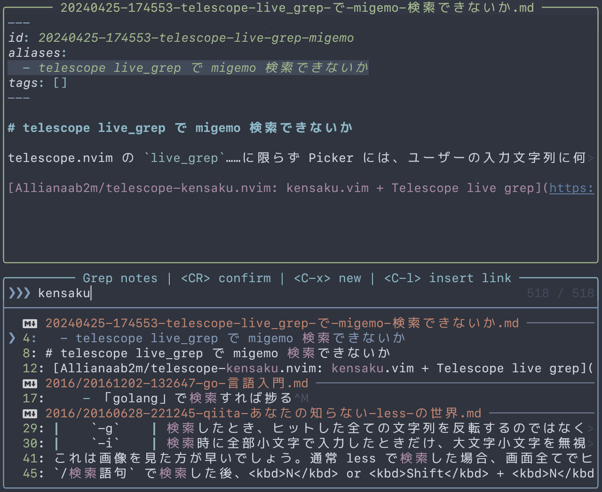

# obsidian-kensaku.nvim



Search the vault with Romaji powered by [obsidian-nvim/obsidian.nvim][].

ローマ字を使って [obsidian-nvim/obsidian.nvim][] の文書を検索します。

[obsidian-nvim/obsidian.nvim]: https://github.com/obsidian-nvim/obsidian.nvim

> [!IMPORTANT]
> v3 onwards targets the [obsidian-nvim/obsidian.nvim][] fork only. If you are
> still on the archived [epwalsh/obsidian.nvim][], pin to the v2 line
> (`version = "^2.0"`).

[epwalsh/obsidian.nvim]: https://github.com/epwalsh/obsidian.nvim

## What's this?

This plugin adds a command `:Obsidian kensaku`. This command looks like
`:Obsidian search` but you can use Romaji to search the vault.

Romaji input is converted to regex using [delphinus/luamigemo][] (a pure Lua
migemo engine). No external binaries or separate processes are required.

> [!NOTE]
> The top-level `:ObsidianKensaku` / `:ObsidianQuickKensaku` user commands
> remain as aliases for compatibility, and will be removed in v4.0.0.

[delphinus/luamigemo]: https://github.com/delphinus/luamigemo

## Requirements

* [obsidian-nvim/obsidian.nvim][]
* [delphinus/luamigemo][] (dictionary bundled — no extra download needed)
* A picker supported by obsidian.nvim: [nvim-telescope/telescope.nvim][],
  [ibhagwan/fzf-lua][], [folke/snacks.nvim][], or [echasnovski/mini.pick][].
  See [Picker support](#picker-support) for the feature matrix.
* [fdschmidt93/telescope-egrepify.nvim][] _(optional, telescope only)_
  - telescope has a bug (https://github.com/nvim-telescope/telescope.nvim/issues/2272)
    that it cannot highlight properly with string matched by regex. I recommend
    you to use telescope-egrepify for this.

[nvim-telescope/telescope.nvim]: https://github.com/nvim-telescope/telescope.nvim
[ibhagwan/fzf-lua]: https://github.com/ibhagwan/fzf-lua
[echasnovski/mini.pick]: https://github.com/echasnovski/mini.pick
[folke/snacks.nvim]: https://github.com/folke/snacks.nvim
[fdschmidt93/telescope-egrepify.nvim]: https://github.com/fdschmidt93/telescope-egrepify.nvim

## Picker support

obsidian-kensaku dispatches to the picker currently selected by
obsidian.nvim (`Obsidian.opts.picker.name`).

| Picker | `:Obsidian kensaku <query>` (one-shot grep) | `:Obsidian kensaku` (live grep) | `:Obsidian quick_kensaku` (live filename) |
| --- | --- | --- | --- |
| telescope.nvim | ✓ | ✓ | ✓ |
| fzf-lua | ✓ | planned (v3.4) | planned (v3.4) |
| snacks.picker | ✓ | planned (v3.3) | planned (v3.3) |
| mini.pick | ✓ | not planned | not planned |
| default (`vim.ui.select`) | ✓ | n/a | n/a |

For pickers other than telescope, the one-shot mode runs `rg` with the
migemo-converted regex and feeds the matched results into the active
picker via the host plugin's `obsidian.picker.pick()` API. This keeps the
picker-specific code minimal.

The live modes need picker-specific hooks (telescope's
`on_input_filter_cb`, fzf-lua's `fzf_live`, snacks.picker's `finder`
callback) and will land in follow-up releases.

## Install

### Pinning to a stable version

This plugin uses [SemVer](https://semver.org/). The v3 line targets
[obsidian-nvim/obsidian.nvim][]; the v2 line targets the archived
[epwalsh/obsidian.nvim][]. Pin accordingly:

```lua
{
  "delphinus/obsidian-kensaku.nvim",
  version = "^3.0", -- for obsidian-nvim/obsidian.nvim
  -- version = "^2.0", -- for epwalsh/obsidian.nvim
}
```

### Add this plugin with your favorite plugin manager

Recommended pattern is to list obsidian-kensaku.nvim as a dependency of
obsidian.nvim and call `setup()` from obsidian.nvim's `post_setup` callback:

```lua
-- example for lazy.nvim
{
  "obsidian-nvim/obsidian.nvim",
  ft = "markdown",
  cmd = { "Obsidian" },
  dependencies = {
    {
      "delphinus/obsidian-kensaku.nvim",
      version = "^3.2",
      dependencies = { { "delphinus/luamigemo", version = "*" } },
    },
  },
  opts = {
    legacy_commands = false,
    callbacks = {
      post_setup = function()
        require("obsidian-kensaku").setup {
          -- picker = "egrepify",
        }
      end,
    },
    -- ... other obsidian.nvim opts ...
  },
}
```

Why this pattern instead of just `opts = {}` on the obsidian-kensaku.nvim spec?
If both plugins claim the same lazy trigger (e.g., `cmd = "Obsidian"`),
lazy.nvim's `handler.del` will delete the real `:Obsidian` user command
after the last claiming plugin loads — even when it was just registered by
obsidian.nvim's own `plugin/obsidian.lua`. Loading obsidian-kensaku.nvim as
a dep avoids the trigger collision entirely.

With this layout the legacy `:ObsidianKensaku` / `:ObsidianQuickKensaku`
user commands only exist after the host plugin has been loaded for the
first time (e.g., on the first markdown buffer or `:Obsidian ...`
invocation). If you rely on the legacy forms before that, add them to a
nested spec for obsidian-kensaku.nvim — they are kensaku-exclusive so
they don't collide with `:Obsidian`:

```lua
{
  "delphinus/obsidian-kensaku.nvim",
  version = "^3.2",
  cmd = { "ObsidianKensaku", "ObsidianQuickKensaku" },
  dependencies = { { "delphinus/luamigemo", version = "*" } },
},
```

`opts = {}` makes lazy.nvim call `require("obsidian-kensaku").setup()` for you.
For other plugin managers, call `setup` manually:

```lua
require("obsidian-kensaku").setup {
  picker = "egrepify",
}
```

> [!NOTE]
> v2 required wiring the plugin from inside `opts.callbacks.post_setup` of
> obsidian.nvim. v3 drops that — `setup()` is self-contained, and obsidian.nvim
> only needs to have been initialized by the time you invoke a command. Listing
> `obsidian-nvim/obsidian.nvim` as a dependency (as above) handles that for you.

## Commands

### `:Obsidian kensaku`

Open the picker like `:Obsidian search`. You can search note **contents** with
Romaji and do the same things as in `:Obsidian search`.

Also available as `:ObsidianKensaku` (legacy; removed in v4.0.0).

### `:Obsidian quick_kensaku`

Open the picker like `:Obsidian quick_switch`. You can search notes by **file
name** with Romaji. This is the kensaku-powered equivalent of
`:Obsidian quick_switch`.

Also available as `:ObsidianQuickKensaku` (legacy; removed in v4.0.0).

## Options

### `dict_path`

* default: `nil` (uses luamigemo's bundled dictionary)
* type: `string`

Path to a custom migemo-compact-dict file. If not specified, the bundled
dictionary included with [delphinus/luamigemo][] is used. You can use this
option to specify a larger dictionary such as the GPL-licensed one from
[oguna/migemo-compact-dict-latest][].

[oguna/migemo-compact-dict-latest]: https://github.com/oguna/migemo-compact-dict-latest

### `query_filter`

* default: built-in Lua migemo
* type: `fun(query: string): string`

A custom function to convert Romaji input into a PCRE regex string for
grep-based search. Overrides the built-in migemo engine.

```lua
{
  query_filter = function(query)
    return some_way_to_create_regex(query)
  end,
}
```

### `picker`

* default: `"default"`
* type: `"default"|"egrepify"`

Use [fdschmidt93/telescope-egrepify.nvim][] instead of telescope's builtin.
Telescope only; ignored when obsidian.nvim is using a non-telescope picker.

### `previewer`

* default: `nil`
* type: `fun(): table`

A function that returns a custom telescope previewer. When set, it is used
for all picker commands. Telescope only; ignored when obsidian.nvim is
using a non-telescope picker.

For example, [delphinus/md-render.nvim][] can render Markdown in the preview
window:

```lua
{
  previewer = function()
    return require("md-render.telescope").previewer()
  end,
}
```

[delphinus/md-render.nvim]: https://github.com/delphinus/md-render.nvim

## LICENSE

MIT license.
